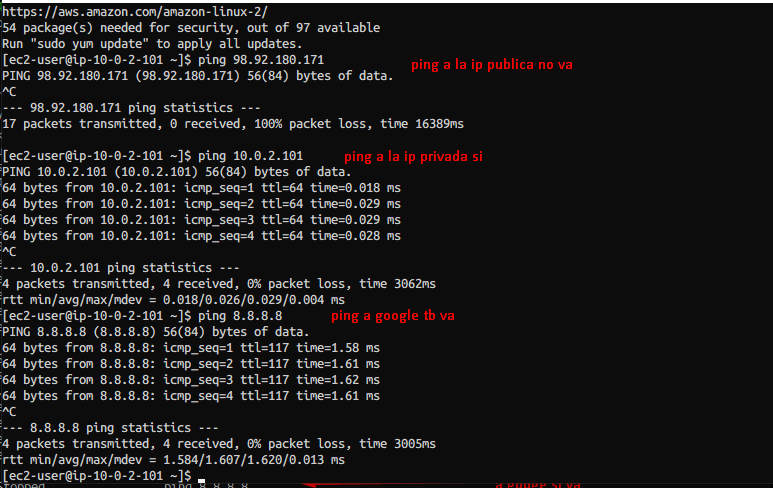

🏗️ Arquitectura general

Regió: us-east-1
Zones de disponibilitat: A i B
VPC: 10.0.0.0/16

Internet Gateway: Permet la connexió de les subxarxes públiques a Internet.
Taula de rutes pública: Redirigeix tot el trànsit (0.0.0.0/0) cap a l’Internet Gateway.

📡 Subxarxes públiques

Subnet A: 10.0.1.0/24 (us-east-1a) → allotja ec2-a

Subnet B: 10.0.2.0/24 (us-east-1b) → allotja ec2-b

Les dues subxarxes tenen assignació automàtica d’IP pública i estan enllaçades a la mateixa taula de rutes pública per mantenir la connexió amb Internet.

🖥️ Instàncies EC2

Nombre d’instàncies: 2 (tipus t3.micro)

Sistema operatiu: Amazon Linux 2023 AMI

ec2-a: desplegada a Public Subnet A (us-east-1a)

ec2-b: desplegada a Public Subnet B (us-east-1b)

Les instàncies estan distribuïdes en dues zones diferents per garantir alta disponibilitat.
Clau SSH: vockey
Etiquetes: ec2-a i ec2-b per identificar-les fàcilment.

🔐 Seguretat — Grup de seguretat
🟢 Regles d’entrada (Ingress)

📍 Port 22 – SSH

Protocol: TCP

Port: 22

Origen: 0.0.0.0/0 (obert a tot arreu)

Funció: Permetre accés remot via SSH des de qualsevol ubicació.

📍 Protocol ICMP – Ping

Protocol: ICMP

Ports: Tots (-1)

Origen: 10.0.0.0/16 (només dins la VPC)

Funció: Habilitar pings únicament entre instàncies dins la mateixa VPC.

🟢 Regles de sortida (Egress)

📍 Tot el trànsit sortint

Protocol: Tots (-1)

Ports: 0–0

Destí: 0.0.0.0/0 (cap a qualsevol lloc)

Funció: Permetre que les instàncies accedeixin lliurement a Internet i altres serveis externs.

🌐 Xarxa i connectivitat

Internet Gateway: Gestiona l’accés extern de les subxarxes públiques.

IPs públiques automàtiques: Assignades en iniciar les instàncies.

Comunicació interna: Les instàncies poden intercanviar trànsit dins la VPC mitjançant IPs privades.

Resolució DNS: Activada per facilitar la traducció de noms d’host dins la xarxa.

🔄 Flux de trànsit

➡️ Entrant:

SSH (Port 22) → Permès des de qualsevol IP

ICMP (Ping) → Permès només des de 10.0.0.0/16

⬅️ Sortint:

Tot el trànsit → Autoritzat cap a qualsevol destinació

🔁 Intern:

Comunicació entre ec2-a i ec2-b → Totalment permesa via adreces privades

COMPROVACIÓ
